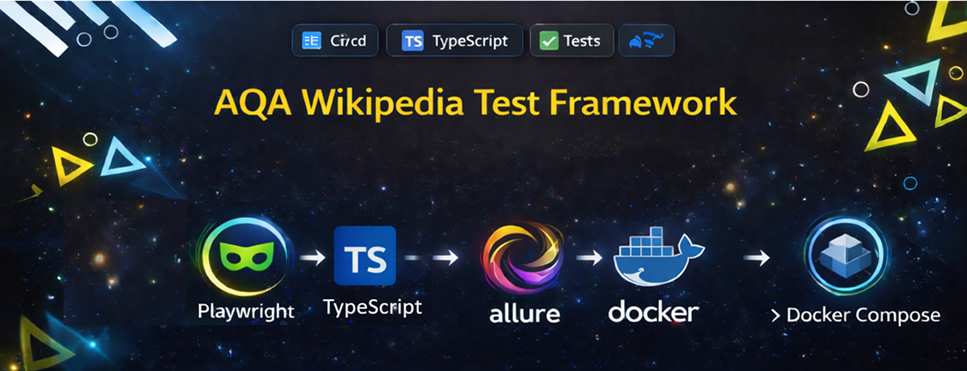

# AQA Wikipedia Framework (Playwright + TypeScript + Docker)

<p align="center">
  
</p>

<p align="center">
  
  
  
  
  
</p>

A production-style **end-to-end UI automation framework** for **Wikipedia** built on **Playwright + TypeScript** with support for:
- **authenticated UI testing**;
- **two login strategies**: authentication via **API** and via **UI**;
- **Page Object Model** with centralized locators and test data;
- **data-driven internationalization checks**;
- **local**, **remote CI**, and **Docker-based** execution;
- automatic **HTML report**, **trace**, **video**, and **screenshots on failure**.

---

## Contents
- [Project Overview](#project-overview)
- [Key Features](#key-features)
- [Tech Stack](#tech-stack)
- [Project Structure](#project-structure)
- [Authentication Strategies](#authentication-strategies)
- [Test Coverage](#test-coverage)
- [Environment Variables](#environment-variables)
- [Getting Started](#getting-started)
- [Running Tests Locally](#running-tests-locally)
- [Running Tests Remotely in CI](#running-tests-remotely-in-ci)
- [Running Tests in Docker](#running-tests-in-docker)
- [Reports and Artifacts](#reports-and-artifacts)
- [Playwright Projects](#playwright-projects)
- [Test Cases](#test-cases)
  - [First test case](#first-test-case)
  - [Second test case](#second-test-case)
- [Troubleshooting](#troubleshooting)
- [Roadmap](#roadmap)

---

## Project Overview

This framework validates that an authenticated Wikipedia user can change the interface language in **Preferences**, save the new value, return to the **Main Page**, and verify that key search controls are localized correctly.

The framework is designed in a maintainable, production-oriented way:
- page behavior is encapsulated in dedicated **Page Objects**;
- selectors are stored in separate **locator enums**;
- expected localized values are stored in dedicated **data enums**;
- authentication is prepared once and reused through **Playwright storage state**;
- test execution is organized through dedicated **Playwright projects**.

The current implementation covers a real end-to-end user flow with authenticated access and post-test cleanup that restores the original English language setting.

---

## Key Features

### ✅ UI automation for authenticated Wikipedia flows
The framework tests a real user scenario on Wikipedia after successful authentication and verifies visible business-critical UI text.

### ✅ Two authentication strategies
The framework supports two reusable authorization approaches:
- **API auth setup** — obtains a login token via MediaWiki API and performs login through API calls;
- **UI auth setup** — performs authentication through the real login page.

Both strategies persist authenticated session state into Playwright storage files and allow downstream test projects to start from an already logged-in state.

### ✅ Production-style Page Object Model
The framework uses dedicated page classes:
- `WikipediaMainPage`
- `WikipediaPreferencesPage`

These classes encapsulate navigation, actions, assertions, and reusable interaction flows.

### ✅ Centralized locators and text expectations
Selectors and visible text are not scattered across tests. They are kept in dedicated enums under `src/locators` and `src/data`, which makes maintenance easier when UI changes happen.

### ✅ Data-driven internationalization validation
The test suite validates multiple language/localization pairs using a single structured data array. Covered languages currently include:
- Spanish
- Portuguese
- French
- German
- Ukrainian
- Polish

### ✅ Failure diagnostics out of the box
The framework is configured to collect:
- **trace** on first retry;
- **screenshots** on failure;
- **video** on failure;
- Playwright HTML report.

### ✅ Ready for local, CI, and containerized execution
The project can be executed:
- on a local machine;
- in **GitHub Actions**;
- inside a **Docker container**;
- via **Docker Compose**.

---

## Tech Stack

- **Playwright** `1.59+`
- **TypeScript** `5.6+`
- **Node.js** `20+` recommended
- **dotenv** for environment variable loading
- **Docker** / **Docker Compose**
- **GitHub Actions** for remote execution

---

## Project Structure

```text
aqa-wikipedia-framework/
├── .github/
│   └── workflows/
│       └── playwright.yml                 # CI pipeline
├── src/
│   ├── api/
│   │   └── auth/
│   │       ├── wiki-auth-api.client.ts    # API-based login and storage state creation
│   │       └── wiki-auth-ui.service.ts    # UI-based login and storage state creation
│   ├── data/
│   │   ├── internationalisation.enum.ts   # Supported interface languages
│   │   └── search-controls.enum.ts        # Expected localized search texts
│   ├── fixtures/
│   │   └── wiki-auth.fixtures.ts          # Custom Playwright fixtures
│   ├── locators/
│   │   ├── wiki-main-page/
│   │   └── wiki-preferences-page/
│   ├── pages/
│   │   ├── WikipediaMainPage.ts           # Main Page object
│   │   └── WikipediaPreferencesPage.ts    # Preferences Page object
│   └── utils/
│       ├── env.ts                         # Environment access helpers
│       └── path.ts                        # Storage state paths
├── tests/
│   └── wiki-internationalisation-settings-tests.spec.ts
├── playwright.config.ts                   # Global Playwright configuration
├── Dockerfile                             # Docker image for test execution
├── docker-compose.yml                     # Docker Compose runner
├── package.json                           # Scripts and dependencies
└── .env                                   # Local environment variables
```

---

## Authentication Strategies

### 1. API-based authentication
Implemented in:
- `src/api/auth/wiki-auth-api.client.ts`

How it works:
1. Requests a MediaWiki login token via `/w/api.php`.
2. Sends login credentials through API.
3. Persists authenticated browser storage state into:
   - `playwright/.auth/user-api.json`

Why it is useful:
- faster than full UI login;
- suitable for stable preconditions;
- reduces repeated UI authentication overhead.

### 2. UI-based authentication
Implemented in:
- `src/api/auth/wiki-auth-ui.service.ts`

How it works:
1. Opens `/wiki/Special:UserLogin`.
2. Enters username and password.
3. Confirms successful redirect to `/wiki/Main_Page`.
4. Persists authenticated browser storage state into:
   - `playwright/.auth/user-ui.json`

Why it is useful:
- validates the real login flow;
- useful when API login is not desirable;
- closer to true user behavior.

---

## Test Coverage

The current suite focuses on **Wikipedia interface internationalization settings**.

Main flow covered:
1. Open Wikipedia Main Page.
2. Open user menu.
3. Navigate to Preferences.
4. Select target interface language.
5. Save settings.
6. Return to Main Page.
7. Validate localized search placeholder text.
8. Validate localized search button text.
9. Restore English language in cleanup.

Covered language datasets:
- `es - español`
- `pt - português`
- `fr - français`
- `de - Deutsch`
- `uk - українська`
- `pl - polski`

Expected localized UI values are stored in:
- `src/data/search-controls.enum.ts`

---

## Environment Variables

The framework uses environment variables loaded via `.env` and `dotenv`.

Required variables:

```env
WIKI_BASE_URL=https://en.wikipedia.org
WIKI_USERNAME=your_username
WIKI_PASSWORD=your_password
```

### Variables description

| Variable | Required | Description |
|---|---:|---|
| `WIKI_BASE_URL` | Yes | Base URL of the target Wikipedia environment |
| `WIKI_USERNAME` | Yes | Username used for login |
| `WIKI_PASSWORD` | Yes | Password used for login |

> `WIKI_USERNAME` and `WIKI_PASSWORD` are mandatory. The framework throws an error if they are not provided.

---

## Getting Started

### Prerequisites

Install the following before running the framework:
- **Node.js 20+**
- **npm**
- **Docker** (optional, for container execution)
- **Docker Compose** (optional)

### Installation

```bash
# clone repository
git clone <your-repository-url>

# go to project root
cd aqa-wikipedia-framework

# install dependencies
npm ci

# install Playwright browser dependencies
npx playwright install --with-deps chromium
```

### Configure environment

Create or update your `.env` file:

```env
WIKI_BASE_URL=https://en.wikipedia.org
WIKI_USERNAME=your_username
WIKI_PASSWORD=your_password
```

---

## Running Tests Locally

### Run the full suite

```bash
npm test
```

This command runs Playwright tests using all configured projects from `playwright.config.ts`.

### Run tests in headed mode

```bash
npm run test:headed
```

Useful for debugging and visual observation.

### Run tests with Playwright UI mode

```bash
npm run test:ui
```

Useful for interactive debugging, step-by-step investigation, and re-running individual tests.

### Run only API-authenticated browser project

```bash
npm run test:api-auth
```

This runs:
- `wikipedia-ui-tests-with-api-auth_[chromium]`

### Run only UI-authenticated browser project

```bash
npm run test:ui-auth
```

This runs:
- `wikipedia-ui-tests-with-ui-auth_[chromium]`

### Run a single spec file directly

```bash
npx playwright test tests/wiki-internationalisation-settings-tests.spec.ts
```

### Run with explicit environment variables from command line

**Linux / macOS**

```bash
WIKI_BASE_URL=https://en.wikipedia.org \
WIKI_USERNAME=your_username \
WIKI_PASSWORD=your_password \
npx playwright test
```

**Windows PowerShell**

```powershell
$env:WIKI_BASE_URL="https://en.wikipedia.org"
$env:WIKI_USERNAME="your_username"
$env:WIKI_PASSWORD="your_password"
npx playwright test
```

---

## Running Tests Remotely in CI

The project already contains a GitHub Actions workflow:
- `.github/workflows/playwright.yml`

### What the CI pipeline does

1. Checks out repository source code.
2. Sets up **Node.js 20**.
3. Installs project dependencies with `npm ci`.
4. Installs Playwright Chromium browser.
5. Runs the Playwright test suite.
6. Uploads generated artifacts:
   - `playwright-report/`
   - `test-results/`

### CI triggers

The workflow runs on:
- push to `main`, `master`, `develop`;
- pull requests to `main`, `master`, `develop`;
- manual run via `workflow_dispatch`.

### Required GitHub secrets

For remote execution in GitHub Actions, define these repository secrets:

```text
WIKI_USERNAME
WIKI_PASSWORD
```

The workflow already sets:

```text
CI=true
WIKI_BASE_URL=https://en.wikipedia.org
```

### Trigger CI manually

After pushing code, GitHub Actions starts automatically for configured branches. You can also launch it from the Actions tab using **Run workflow**.

---

## Running Tests in Docker

The framework is container-ready and uses the official Playwright image.

### Option 1. Build and run with Docker

```bash
# build image
Docker build -t aqa-wikipedia-framework .

# run tests inside container
Docker run --rm \
  --env-file .env \
  -v "$(pwd)/playwright-report:/app/playwright-report" \
  -v "$(pwd)/test-results:/app/test-results" \
  -v "$(pwd)/playwright/.auth:/app/playwright/.auth" \
  aqa-wikipedia-framework
```

### Option 2. Run with Docker Compose

```bash
docker compose up --build
```

Current `docker-compose.yml` runs:

```bash
npx playwright test --project="wikipedia-ui-tests-with-api-auth_[chromium]"
```

This is a good default for stable container-based execution because it reuses API-created authenticated state.

### Docker execution flow

1. Builds image from `mcr.microsoft.com/playwright:v1.59.1-noble`.
2. Installs Node dependencies via `npm ci`.
3. Copies project source.
4. Runs Playwright tests inside the container.
5. Persists reports and test results to mounted host folders.

### Useful Docker notes

- Keep `.env` configured before launching containers.
- The following folders are mounted from host to container:
  - `playwright-report/`
  - `test-results/`
  - `playwright/.auth/`
- This makes it easy to inspect reports after container execution finishes.

---

## Reports and Artifacts

The framework uses Playwright reporters and built-in diagnostics.

### HTML report

Generate/open report after run:

```bash
npm run report
```

### Stored artifacts

Depending on execution result, the framework stores:
- **HTML report** in `playwright-report/`
- **test artifacts** in `test-results/`
- **authenticated storage state** in `playwright/.auth/`

### Failure diagnostics

Configured in `playwright.config.ts`:
- `trace: 'on-first-retry'`
- `screenshot: 'only-on-failure'`
- `video: 'retain-on-failure'`

This makes debugging significantly easier in local and CI runs.

---

## Playwright Projects

The framework defines four Playwright projects:

### `auth-api-setup`
Runs API-based authentication setup and prepares storage state for dependent test projects.

### `auth-ui-setup`
Runs UI-based authentication setup and prepares storage state for dependent test projects.

### `wikipedia-ui-tests-with-api-auth_[chromium]`
Runs browser tests with:
- `browserName: chromium`
- storage state from API authentication
- dependency on `auth-api-setup`

### `wikipedia-ui-tests-with-ui-auth_[chromium]`
Runs browser tests with:
- `browserName: chromium`
- storage state from UI authentication
- dependency on `auth-ui-setup`

This design cleanly separates **session preparation** from **functional test execution**.

---

## Test Cases

Below are the two test cases included exactly as requested for README documentation.

---

## First test case

# Formal Test Case

**ID:** TC-WIKI-INTL-001  
**Name:** Change interface language for an authorized user

## Requirement:
The system shall allow an authenticated user to change the Wikipedia interface language via the Preferences page and apply the selected localization to the UI.

## Preconditions:
- Authorized user is logged in.
- Preferences page is accessible.
- Target language exists in Wikipedia Preferences.
- Expected localized UI values are defined for validation.

## Test Steps and Expected Results:

| Step | Action | Expected Result |
|---:|---|---|
| 1 | Open Wikipedia Main Page | Main Page is displayed successfully |
| 2 | Open user menu | User menu is displayed |
| 3 | Click Preferences | Preferences page is opened |
| 4 | Select target language | The selected language is applied in the Preferences form |
| 5 | Click Save | Changes are saved successfully |
| 6 | Click Wikipedia logo | Main Page is opened |
| 7 | Verify search placeholder text | Placeholder matches expected localized value |
| 8 | Verify search button text | Button label matches expected localized value |
| 9 | Restore English language | Application state is reset successfully |

## Expected Outcome:
The interface language is changed successfully, and the Main Page displays the correct localized search controls for the selected language.

## Cleanup:
Reset interface language to English.

---

## Second test case

# Test Case: Verify that an authorized Wikipedia user can change the interface language

**Test Case ID:** WC-INT-001  
**Title:** Verify that an authorized user can successfully change the Wikipedia interface language from Preferences  
**Priority:** High  
**Type:** Functional / UI / Positive  
**Automation Status:** Automated

## Objective
To verify that an authenticated Wikipedia user can change the application interface language in Preferences, save the change successfully, and see the updated localized UI on the Main Page.

## Preconditions
- The user account is valid and active.
- The user is authenticated.
- The user has access to the Wikipedia Main Page and Preferences page.
- The default or cleanup language can be restored after test execution.
- Test data for target languages and expected localized search control texts is available.

## Test Data
The following language/localization pairs are covered:
- Spanish → `Buscar en Wikipedia` / `Buscar`
- Portuguese → `Procurar em Wikipedia` / `Procurar`
- French → `Rechercher sur Wikipedia` / `Rechercher`
- German → `Wikipedia durchsuchen` / `Suchen`
- Ukrainian → `Пошук у Wikipedia` / `Знайти`
- Polish → `Przeszukaj Wikipedię` / `Szukaj`

## Steps
1. Open the Wikipedia Main Page.
2. Open the user menu.
3. Navigate to the Preferences page.
4. Select a target interface language from the available test data.
5. Save the updated language preference.
6. Return to the Wikipedia Main Page by clicking the Wikipedia logo.
7. Verify that the search input placeholder matches the expected localized value.
8. Verify that the search button text matches the expected localized value.
9. Restore the interface language to English after test execution.

## Expected Result
- The selected interface language is saved successfully.
- The user is redirected or returned to the Main Page.
- The Main Page UI reflects the chosen language.
- The search input placeholder displays the expected localized text.
- The search button displays the expected localized text.
- The interface language is reset to English during test cleanup.

## Postconditions
- The user remains authenticated.
- The interface language is restored to English.

## Notes
- The test is data-driven and should run once per configured language.
- Verification is based on stable, user-visible UI elements rather than internal implementation details.
- Cleanup is mandatory to keep the account state consistent across runs.

---

## Troubleshooting

### `WIKI_USERNAME is not set` or `WIKI_PASSWORD is not set`
Make sure your `.env` file exists and contains valid credentials.

### Browser dependencies are missing
Run:

```bash
npx playwright install --with-deps chromium
```

### Docker run cannot access environment variables
Check that:
- `.env` exists in the project root;
- you run container with `--env-file .env`;
- variable names match exactly.

### Report is not opening
Run:

```bash
npm run report
```

### Authentication fails in CI
Check GitHub repository secrets:
- `WIKI_USERNAME`
- `WIKI_PASSWORD`

---

## Roadmap

Possible next production improvements:
- add more Wikipedia preference scenarios;
- add negative and validation-oriented tests;
- add multi-browser execution;
- add richer tagging and suite segmentation;
- publish HTML reports automatically to Pages or external storage;
- integrate linting, formatting, and pre-commit quality gates.

---

## License

This repository is intended as an automation framework example / portfolio-style QA project. Add your preferred license if the repository is going to be published publicly.
